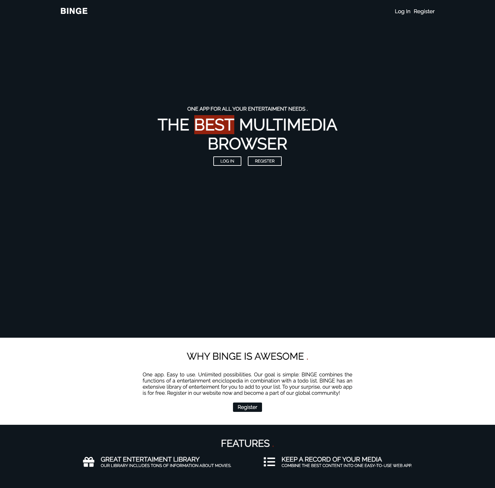
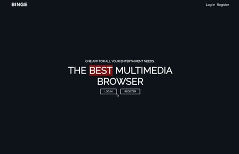
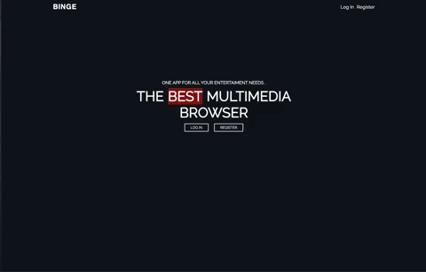
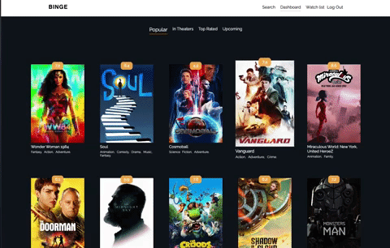

<h1 align="center">Binge</h1>

<h2 align="center">

</h2>

<p align="center">
  


</p>



<h2 align="center"><a  href="https://aneudy-binge.netlify.app/">Live Demo</a></h2>

### [Contributions are Welcome](https://github.com/aneudya4/watched.git)

## Description

<p align="center">
One app. Easy to use. Unlimited possibilities. My goal is simple: BINGE combines the functions of a entertainment encyclopedia in combination with a todo list. BINGE has an extensive library of enterteiment for you to add to your list. To your surprise, our web app is for free.

## How Register.

### Binge App Registration:

- **START** Click the Register button on the Navigation or on the banner.
- **Fill u and submit** Fill up the input box for Name,Email and Password.
- **Register** Click the Register button

<p align="center"></p>

### Binge App Demo Account:

- **START** Click the Login button on the Navigation or on the banner.
- **Demo** Click the Demo button

<p align="center"></p>

## About the project:

### Binge:

- Binge is a mobile responsive app that was built with React,Redux,Redux-thunk Node, Express,Firebase for authentication and postgresSQL

### Watchlist:

User will see a list of movies added by themselves to the watchlist

<p align="center"></p>

### Search

User will see a list of movies that match the search terms

<p align="center"></p>

### The Add and remove movie from watchlist page:

User clicks add or remove from watchlist.

<p align="center"></p>

### Project setup:

```bash
git clone https://github.com/aneudya4/watched.git
cd watched
npm install
npm run start
open http://localhost:3000
```

## NOTE:

- **issue with fetching** You will need to connect to a server, here is the repo for the local server

<h2 align="center"><a  href="https://github.com/aneudya4/watched-server.git
">Local Server Repo</a></h2>

## Future scope:

- Adding Tv shows
- Adding a user profile section for user to edit their information
